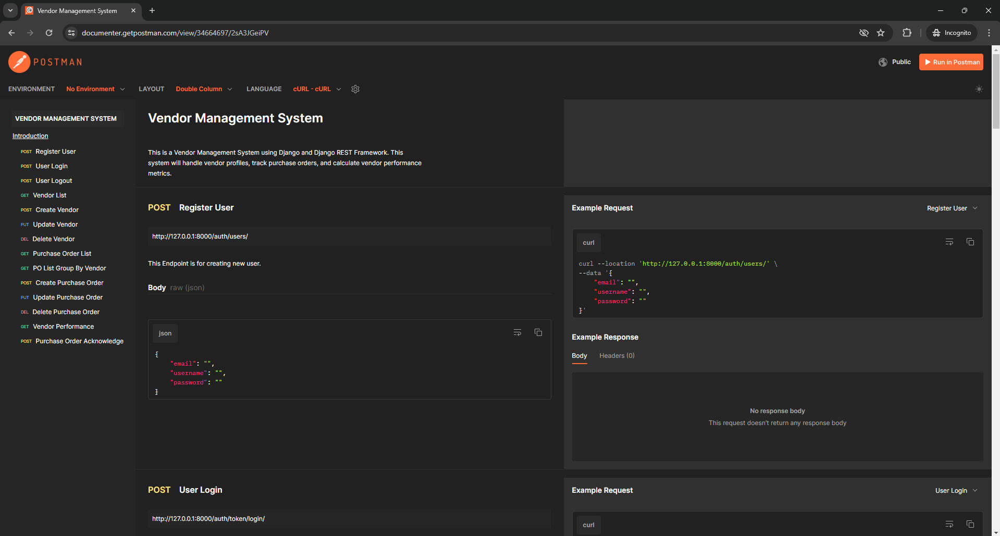
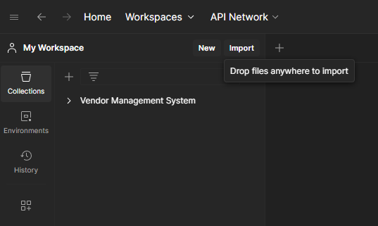

# VENDOR MANAGEMENT SYSTEM

<div align="center">
  
</div>
This repository showcases a Vendor Management System using Django and Django REST Framework. This
system will handle vendor profiles, track purchase orders, and calculate vendor performance
metrics.


## API DOCUMENTATION: [Link](https://documenter.getpostman.com/view/34664697/2sA3JGeiPV)

## How to run this project locally.
To run this project, you will need to install the required libraries. Follow the steps below to get started:

1. Clone the repository and navigate to the project directory.
```
git clone https://github.com/gajjug004/Vendor-Management-System.git
cd Vendor-Management-System
```
2. Create a new virtual environment using python, and activate the environment with cmd:
```
python -m venv venv
venv\Scripts\activate
```
3. Install the required libraries using the following commands:
```
pip install -r requirements.txt
```
4. Execute this command to run the server:
```
python manage.py runserver
```

## Testing API Endpoints Through POSTMAN
To test API Endpoints using POSTMAN. Follow the steps below :

1. Open Postman

2. Go to import 

<div align="center">
  
</div>

3. Select the Vendor Management System.postman_collection.json file

4. Click on import button

Now you are ready to test all the Endpoints.